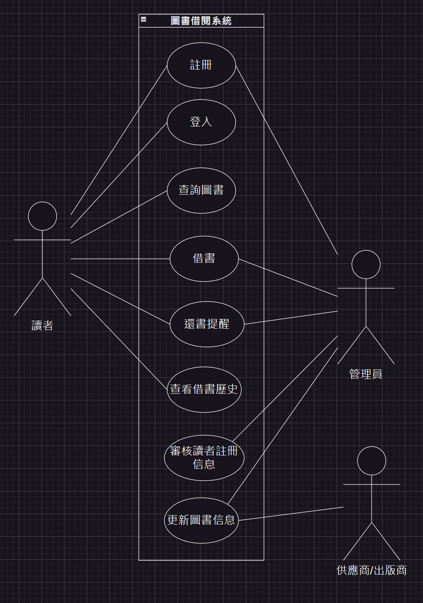
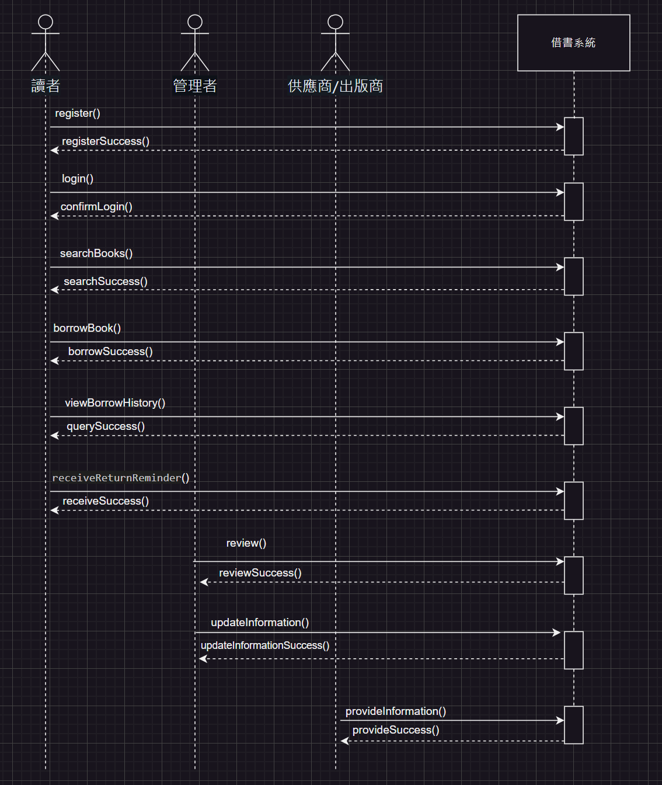

# 系統分析與設計期末專案
>
 111111109 張雅薰 111111113 張昕妤 

本份文件包含以下主題：
- [x] 敘述
- [x] 內容

## 系統概述
隨著閱讀需求的增加，借書系統變得越來越重要。為了滿足讀者對便利性和服務質量的需求，我們決定開發一款全新的線上借書系統。該系統將提供一系列功能，從圖書查詢到借書操作、還書提醒等，以減少人工錯誤，提高圖書館管理效率，並提供更優質的讀者服務。 系統將分為前台和後台兩個部分。 

前台功能，讀者可以使用手機號碼和電子信箱註冊並登錄系統，註冊時需填寫基本信息(姓名、聯繫方式)。登入系統後讀者可以瀏覽圖書館的藏書目錄，按分類、作者、標題或關鍵字進行查詢，每本書都會顯示詳細信息(書名、作者、出版日期、館藏狀態)。讀者可以選擇要借的書籍，加入到借書籃中，確認借書信息後，系統會生成借書清單，並顯示預計還書日期。讀者可以查看自己的借書歷史，了解已借和已還的書籍，系統會在還書日期臨近時發送提醒通知，避免逾期。 

後台功能
管理員可以審核和管理讀者的註冊信息、更新圖書信息(新增、修改和刪除)，審核借書申請，確認是否允許借出，並可以查看圖書的庫存狀態，管理借書和還書記錄。管理員可以建立圖書的分類和標籤，方便讀者查詢。設定系統自動發送還書提醒、逾期通知消息給讀者。

## 內容
### 利害人關係表
|  利害人   | 目標  |
|  ----  | ----  |
|前台：  |  |
|讀者| 1.註冊並登入系統，使用圖書查詢和借書服務。 2.查看借書歷史和接收還書提醒。 3.瀏覽和查詢圖書館藏書。 |
|||
|後台： |  |
|  管理者 | 1.有審核和管理讀者註冊信息。 2.更新圖書信息和管理圖書分類。 3.審核借書申請和管理借書還書記錄。 |
| 供應商/出版商 | 提供圖書信息更新和新書上架。 |

### 事件表  
|  事件名稱   | 使用案例  |
|  ----  | ----  |
| 前台:  |  |
| 註冊| 使用手機號碼和電子信箱註冊賬戶。 |
| 登入 | 使用註冊的手機號碼或電子信箱登入系統。|
| 查詢圖書| 按分類、作者、標題或關鍵字查詢圖書。 |
| 查看圖書詳細信息 | 查看書名、作者、出版日期和館藏狀態等詳細信息。|
| 借書 | 選擇圖書並加入借書籃，系統生成借書清單並顯示預計還書日期。|
| 查看借書歷史| 查看已借和已還的書籍。 |
| 接收還書提醒 |系統在還書日期臨近時自動發送提醒通知給讀者。|
| 後台:  |  |
| 審核讀者註冊信息 | 審核和管理讀者的註冊信息，確保資料的正確性和完整性。 |
| 更新圖書信息 | 新增、修改和刪除圖書信息，確保圖書館資源的即時更新。 |

### 使用案例圖

### 使用案例表

#### 使用案例1

| 使用案例名稱 | 註冊 |
| ------------- | ---- |
| 使用案例描述 | 讀者使用手機號碼或電子郵件在線上借書系統上註冊成為會員，以便瀏覽圖書館藏書、借閱圖書和使用其他服務。 |
| 主要參與者 | 讀者 |
| 利害關係人與目標 | 1. 讀者：希望能夠快速、簡便地註冊成為會員，以便使用系統的全部功能，包括查詢圖書、借閱圖書和接收還書提醒。 2. 圖書館：希望通過會員註冊獲取讀者信息，以便提供更好的服務和管理借書流程。 |
| 前置條件 |  讀者有可用的手機號碼或電子郵件地址。 |
| 後置條件 | 1. 讀者成功註冊成為會員，並可以使用系統的全部功能。 2. 系統記錄讀者的基本信息，並向讀者發送歡迎信息或確認郵件。 |
| 主要成功情節 | 1. 讀者打開借書系統並選擇註冊選項。 2. 系統提示讀者輸入手機號碼或電子郵件地址。 3. 讀者輸入手機號碼或電子郵件地址並提交。 4. 系統發送驗證碼到讀者的手機或電子郵件。 5. 讀者輸入收到的驗證碼並提交。 6. 系統驗證碼驗證成功後，提示讀者設置密碼。 7. 讀者設置密碼並提交。 8. 系統顯示註冊成功信息，並自動登錄到系統主界面。 |
| 例外情節與其他需求 | 1. 驗證碼發送失敗 2. 驗證碼輸入錯誤 3. 手機號碼或電子郵件已被使用 4. 網絡連接問題 5. 安全性需求 6. 讀者隱私 |

#### 使用案例2

| 使用案例名稱 | 登入 |
| ------------- | ---- |
| 使用案例描述 | 讀者使用註冊的手機號碼或電子郵件和密碼登錄到借書系統，以便瀏覽圖書館藏書、借閱圖書和使用其他服務。 |
| 主要參與者 | 讀者 |
| 利害關係人與目標 | 讀者：希望能夠快速、安全地登錄系統，以便使用系統的全部功能。 |
| 前置條件 | 讀者已註冊並有可用的帳號和密碼。 |
| 後置條件 |讀者成功登錄系統，並可以使用系統的全部功能。 |
| 主要成功情節 | 1. 讀者打開借書系統並選擇登錄選項。 2. 系統提示讀者輸入手機號碼或電子郵件和密碼。 3. 讀者輸入正確的帳號和密碼並提交。 4. 系統驗證成功後，顯示登錄成功信息，並進入系統主界面。 |
| 例外情節與其他需求 | 1. 帳號或密碼輸入錯誤 2. 帳號被鎖定 3. 網絡連接問題 4. 安全性需求 5. 讀者隱私 |

#### 使用案例3

| 使用案例名稱 | 查詢圖書 |
| ------------- | ---- |
| 使用案例描述 | 讀者按分類、作者、標題或關鍵字查詢圖書館藏書，並查看圖書的詳細信息。 |
| 主要參與者 | 讀者 |
| 利害關係人與目標 |讀者：希望能夠快速、準確地查詢到所需的圖書信息，以便決定是否借閱。 |
| 前置條件 | 讀者已登錄系統。 |
| 後置條件 | 讀者看到查詢結果，並可查看圖書的詳細信息。 |
| 主要成功情節 | 1. 讀者在系統中輸入查詢條件（分類、作者、標題或關鍵字）。 2. 系統根據查詢條件返回符合的圖書列表。 3. 讀者選擇其中一本圖書，查看其詳細信息（書名、作者、出版日期、館藏狀態）。 |
| 例外情節與其他需求 | 1. 查詢條件輸入錯誤 2. 系統無法找到符合條件的圖書 3. 網絡連接問題 4. 安全性需求 5. 讀者隱私 |

#### 使用案例4

| 使用案例名稱 | 查看圖書詳細信息 |
| ------------- | ---- |
| 使用案例描述 | 查看書名、作者、出版日期和館藏狀態等詳細信息。 |
| 主要參與者 | 讀者 |
| 利害關係人與目標 | 能夠方便地瀏覽圖書的詳細資訊，以便做出借書決策。 |
| 前置條件 | 讀者已經成功登入系統。 |
| 後置條件 | 讀者能夠看到所查詢圖書的詳細資訊並可進一步操作，例如加入借書籃或返回查詢結果頁面。 |
| 主要成功情節 | 1.讀者進入圖書詳細資訊頁面。 2.系統顯示圖書的書名、作者、出版日期和館藏狀態等詳細信息。  |
| 例外情節與其他需求 |如果圖書信息不完整或系統錯誤，系統應能夠提示讀者相關信息或錯誤訊息，並提供反饋機制以改進用戶體驗。|

#### 使用案例5

| 使用案例名稱 | 借書 |
| ------------- | ---- |
| 使用案例描述 | 讀者選擇要借的書籍，加入到借書籃中，確認借書信息後，系統生成借書清單並顯示預計還書日期。 |
| 主要參與者 | 讀者 |
| 利害關係人與目標 | 讀者：希望能夠方便地借閱所需的圖書，並清楚地知道還書日期。 |
| 前置條件 | 1. 讀者已登錄系統。 2. 讀者已查詢並選擇了要借的圖書。 |
| 後置條件 | 借書申請成功，系統生成借書清單並顯示預計還書日期。 |
| 主要成功情節 | 1. 讀者在系統中選擇要借的圖書並加入借書籃。 2. 系統提示讀者確認借書信息。 3. 讀者確認信息並提交借書申請。 4. 系統生成借書清單並顯示預計還書日期。 |
| 例外情節與其他需求 | 1. 圖書已被其他讀者借出 2. 圖書狀態不允許借閱 3. 網絡連接問題 4. 安全性需求 5. 讀者隱私 |

#### 使用案例6

| 使用案例名稱 | 查看借書歷史 |
| ------------- | ---- |
| 使用案例描述 | 讀者查看自己已借和已還的書籍，了解借閱記錄。 |
| 主要參與者 | 讀者 |
| 利害關係人與目標 | 1. 讀者：希望能夠方便地查看自己的借書歷史，了解已借和已還的書籍。 |
| 前置條件 | 1. 讀者已登錄系統。 |
| 後置條件 | 1. 讀者看到自己的借書歷史。 |
| 主要成功情節 | 1. 讀者在系統中選擇查看借書歷史選項。 2. 系統顯示讀者的借書歷史，包括已借和已還的書籍。 |
| 例外情節與其他需求 | 1. 系統無法找到借書歷史 2. 網絡連接問題 3. 安全性需求 4. 讀者隱私 |

#### 使用案例7

| 案例名稱         | 接收還書提醒                               |
|----------------|------------------------------------------|
| 案例描述         | 系統自動發送提醒通知給讀者，提醒即將到期的借書需還書。 |
| 主要參與者        | 讀者                                      |
| 利害關係人與目標    | 1. 讀者：希望及時收到還書提醒，避免逾期罰款或其他問題。 2. 圖書館管理員：希望通過提醒功能，促進讀者及時還書，有效管理圖書館資源。 |
| 前置條件         | 1. 讀者已註冊並成功登入系統。  2. 讀者已借閱至少一本圖書，並設定了預計還書日期。                 |
| 後置條件         | 系統成功發送了還書提醒通知給讀者。             |
| 主要成功情節       | 1. 系統判斷到讀者的借書記錄即將到期。    2. 系統自動向讀者發送提醒通知，包含借書詳細資訊和還書截止日期。            |
| 例外情節與其他需求   | 1. 無法發送提醒通知，如網絡連接問題或系統故障。   2. 讀者設置了不接收提醒的偏好設置。      |

#### 使用案例8

| 使用案例名稱       | 審核讀者註冊信息                           |
|--------------------|------------------------------------------|
| 使用案例描述       | 管理者審核和管理讀者的註冊信息。                      |
| 主要參與者         | 管理者                                      |
| 利害關係人與目標   | 1.管理者：確保讀者信息真實有效。 2.讀者：能夠順利完成註冊。  |
| 前置條件           | 讀者提交註冊申請。                             |
| 後置條件           | 註冊信息被審核通過或拒絕。                          |
| 主要成功情節       | 管理者成功審核並確認讀者信息。                        |
| 例外情節或其他需求 | 讀者信息不完整或不正確，需重新提交。                    |

#### 使用案例9

| 使用案例名稱       | 更新圖書信息 |
|--------------------|------------------------------------------|
| 使用案例描述       | 管理者新增、修改或刪除圖書的信息。|
| 主要參與者         | 管理者|
| 利害關係人與目標   | 1.管理者：保持圖書信息的準確性和最新狀態。 2.讀者：查詢到最新的圖書信息。|
| 前置條件           | 圖書信息需要更新。|
| 後置條件           | 圖書信息已更新。|
| 主要成功情節       | 管理者成功新增、修改或刪除圖書信息。|
| 例外情節或其他需求 | 更新過程中出現系統錯誤需進行排查和修復。|

### 初步類別圖

### 方法合約
|合約1: |openRegistrationPage |
|----------|------|
|操作:|顯示註冊頁面給讀者。 |
|交互參照:|註冊 |
|前置條件:|顧客有可用的手機號碼或電子郵件地址。 |
|後置條件:|註冊頁面已加載並顯示給讀者。 |

| 合約2 | 登入 |
|----------|------|
| 操作 |  |
| 交互參照 | 使用案例：登入 |
| 前置條件 | 讀者已註冊並有可用的帳號和密碼。 |
| 後置條件 | 讀者成功登入系統，並可以使用系統的全部功能。 |

| 合約名稱 | 查詢書籍 |
|----------|----------|
| 操作 |  |
| 交互參照 | 使用案例：查詢書籍 |
| 前置條件 | 讀者已登入系統。 |
| 後置條件 | 讀者看到查詢結果，並可查看圖書的詳細信息。 |

| 合約名稱 | 借書 |
|----------|------|
| 操作 |  |
| 交互參照 | 使用案例：借書 |
| 前置條件 | 1. 讀者已登入系統。 2. 讀者已查詢並選擇了要借的圖書。 |
| 後置條件 | 借書申請成功，系統生成借書清單並顯示預計還書日期。 |

| 合約名稱 | 查閱歷史紀錄 |
|----------|--------------|
| 操作 |  |
| 交互參照 | 使用案例：查閱歷史紀錄 |
| 前置條件 | 讀者已登入系統。 |
| 後置條件 | 讀者看到自己的借書歷史。 |

| 合約名稱 | 審核 |
|----------|------|
| 操作 |  |
| 交互參照 | 使用案例：審核讀者註冊信息 |
| 前置條件 | 讀者提交註冊申請。 |
| 後置條件 | 註冊信息被審核通過或拒絕。 |

| 合約名稱 | 更新信息 |
|----------|----------|
| 操作 |  |
| 交互參照 | 使用案例：更新圖書信息 |
| 前置條件 | 圖書信息需要更新。 |
| 後置條件 | 圖書信息已更新。 |

| 合約名稱 | 管理分類 |
|----------|----------|
| 操作 |  |
| 交互參照 | 使用案例：管理分類 |
| 前置條件 | 系統中已有圖書資料。 |
| 後置條件 | 新分類和標籤成功建立。 |

| 合約名稱 | 提供信息 |
|----------|----------|
| 操作 |  |
| 交互參照 | 使用案例：提供信息 |
| 前置條件 | 圖書館需要更新或上架新書。 |
| 後置條件 | 圖書信息已成功更新或新書上架。 |

### 循序圖

