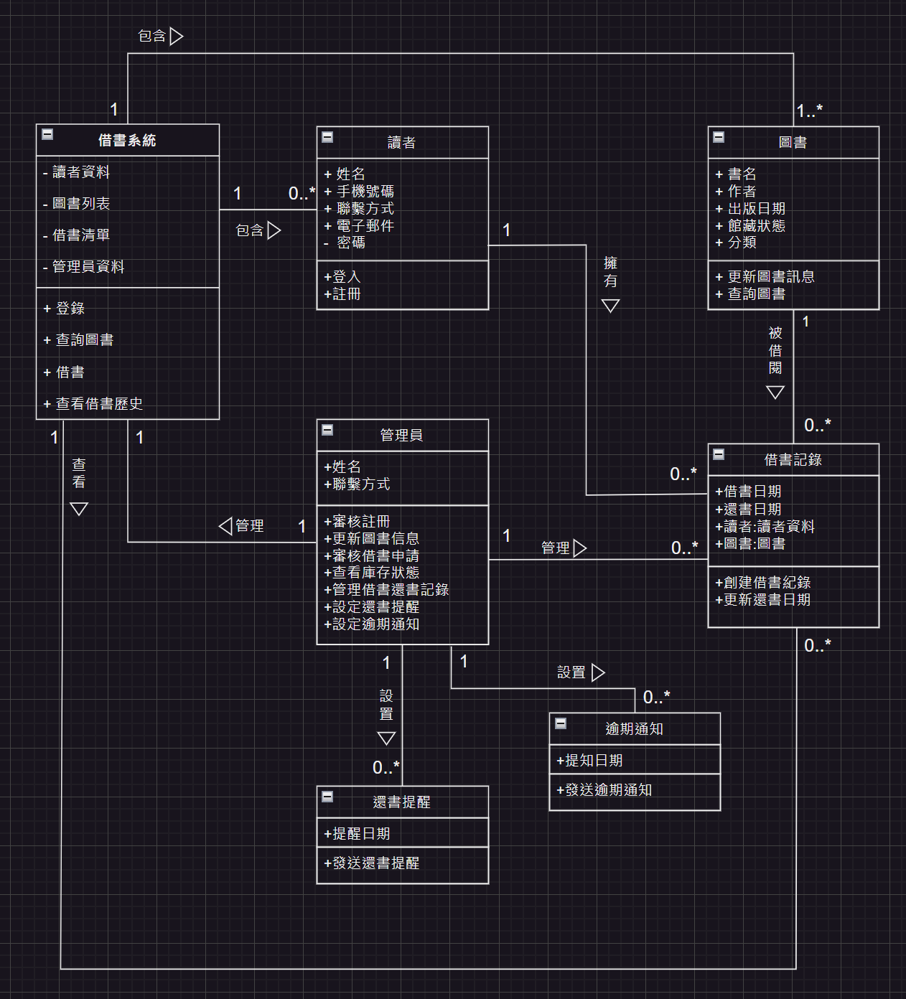

# 系統分析與設計期末專案
>
 111111109 張雅薰 111111113 張昕妤 

本份文件包含以下主題：
- [x] 敘述
- [x] 內容

## 系統概述
隨著閱讀需求的增加，借書系統變得越來越重要。為了滿足讀者對便利性和服務質量的需求，我們決定開發一款全新的線上借書系統。該系統將提供一系列功能，從圖書查詢到借書操作、還書提醒等，以減少人工錯誤，提高圖書館管理效率，並提供更優質的讀者服務。 系統將分為前台和後台兩個部分。 

前台功能，讀者可以使用手機號碼和電子信箱註冊並登錄系統，註冊時需填寫基本信息(姓名、聯繫方式)。登入系統後讀者可以瀏覽圖書館的藏書目錄，按分類、作者、標題或關鍵字進行查詢，每本書都會顯示詳細信息(書名、作者、出版日期、館藏狀態)。讀者可以選擇要借的書籍，加入到借書籃中，確認借書信息後，系統會生成借書清單，並顯示預計還書日期。讀者可以查看自己的借書歷史，了解已借和已還的書籍，系統會在還書日期臨近時發送提醒通知，避免逾期。 

後台功能
管理員可以審核和管理讀者的註冊信息、更新圖書信息(新增、修改和刪除)，審核借書申請，確認是否允許借出，並可以查看圖書的庫存狀態，管理借書和還書記錄。管理員可以建立圖書的分類和標籤，方便讀者查詢。設定系統自動發送還書提醒、逾期通知消息給讀者。

## 內容
### 利害人關係表
|  利害人   | 目標  |
|  ----  | ----  |
|前台：  |  |
|讀者| 1.註冊並登入系統，使用圖書查詢和借書服務。 2.查看借書歷史和接收還書提醒。 3.瀏覽和查詢圖書館藏書。 |
|||
|後台： |  |
|  管理者 | 1.有審核和管理讀者註冊信息。 2.更新圖書信息和管理圖書分類。 3.審核借書申請和管理借書還書記錄。 |
| 系統開發人員 | 持續改進和升級系統功能，修復漏洞。 |
| 供應商/出版商 | 提供圖書信息更新和新書上架。 |

### 事件表  
|  事件名稱   | 使用案例  |
|  ----  | ----  |
| 前台:  |  |
| 註冊| 使用手機號碼和電子信箱註冊賬戶。 |
| 登入 | 使用註冊的手機號碼或電子信箱登入系統。|
| 查詢圖書| 按分類、作者、標題或關鍵字查詢圖書。 |
| 查看圖書詳細信息 | 查看書名、作者、出版日期和館藏狀態等詳細信息。|
| 借書 | 選擇圖書並加入借書籃，生成借書清單並顯示預計還書日期。|
| 查看借書歷史| 查看已借和已還的書籍。 |
| 接收還書提醒 | 系統在還書日期臨近時發送提醒通知。|
| 後台:  |  |
| 審核讀者註冊信息 | 審核和管理註冊信息。 |
| 更新圖書信息 | 新增、修改和刪除圖書信息。 |
| 管理圖書分類 | 建立和更新圖書的分類和標籤。 |
| 審核借書申請 | 審核借書申請，確認是否允許借出。 |
| 查看庫存狀態 | 查看圖書的庫存狀態。 |
| 管理借書還書記錄 |管理借書和還書記錄。 |
| 設定還書提醒 | 系統自動發送還書提醒。 |
| 設定逾期通知 |系統自動發送逾期通知消息給讀者。 |
| 系統維護和更新 |進行系統維護和更新，確保系統穩定運行。 |
| 新書上架 |提供圖書信息更新和新書上架。 |

 

### 使用案例表

#### 使用案例1

| 使用案例名稱 | 註冊 |
| ------------- | ---- |
| 使用案例描述 | 讀者使用手機號碼或電子郵件在線上借書系統上註冊成為會員，以便瀏覽圖書館藏書、借閱圖書和使用其他服務。 |
| 主要參與者 | 讀者 |
| 利害關係人與目標 | 1. 讀者：希望能夠快速、簡便地註冊成為會員，以便使用系統的全部功能，包括查詢圖書、借閱圖書和接收還書提醒。 2. 圖書館：希望通過會員註冊獲取讀者信息，以便提供更好的服務和管理借書流程。 |
| 前置條件 | 1. 讀者有可用的手機號碼或電子郵件地址。 |
| 後置條件 | 1. 讀者成功註冊成為會員，並可以使用系統的全部功能。 2. 系統記錄讀者的基本信息，並向讀者發送歡迎信息或確認郵件。 |
| 主要成功情節 | 1. 讀者打開借書系統並選擇註冊選項。 2. 系統提示讀者輸入手機號碼或電子郵件地址。 3. 讀者輸入手機號碼或電子郵件地址並提交。 4. 系統發送驗證碼到讀者的手機或電子郵件。 5. 讀者輸入收到的驗證碼並提交。 6. 系統驗證碼驗證成功後，提示讀者設置密碼。 7. 讀者設置密碼並提交。 8. 系統顯示註冊成功信息，並自動登錄到系統主界面。 |
| 例外情節與其他需求 | 1. 驗證碼發送失敗 2. 驗證碼輸入錯誤 3. 手機號碼或電子郵件已被使用 4. 網絡連接問題 5. 安全性需求 6. 讀者隱私 |

#### 使用案例2

| 使用案例名稱 | 登錄 |
| ------------- | ---- |
| 使用案例描述 | 讀者使用註冊的手機號碼或電子郵件和密碼登錄到借書系統，以便瀏覽圖書館藏書、借閱圖書和使用其他服務。 |
| 主要參與者 | 讀者 |
| 利害關係人與目標 | 1. 讀者：希望能夠快速、安全地登錄系統，以便使用系統的全部功能。 |
| 前置條件 | 1. 讀者已註冊並有可用的帳號和密碼。 |
| 後置條件 | 1. 讀者成功登錄系統，並可以使用系統的全部功能。 |
| 主要成功情節 | 1. 讀者打開借書系統並選擇登錄選項。 2. 系統提示讀者輸入手機號碼或電子郵件和密碼。 3. 讀者輸入正確的帳號和密碼並提交。 4. 系統驗證成功後，顯示登錄成功信息，並進入系統主界面。 |
| 例外情節與其他需求 | 1. 帳號或密碼輸入錯誤 2. 帳號被鎖定 3. 網絡連接問題 4. 安全性需求 5. 讀者隱私 |

#### 使用案例3

| 使用案例名稱 | 查詢圖書 |
| ------------- | ---- |
| 使用案例描述 | 讀者按分類、作者、標題或關鍵字查詢圖書館藏書，並查看圖書的詳細信息。 |
| 主要參與者 | 讀者 |
| 利害關係人與目標 | 1. 讀者：希望能夠快速、準確地查詢到所需的圖書信息，以便決定是否借閱。 |
| 前置條件 | 1. 讀者已登錄系統。 |
| 後置條件 | 1. 讀者看到查詢結果，並可查看圖書的詳細信息。 |
| 主要成功情節 | 1. 讀者在系統中輸入查詢條件（分類、作者、標題或關鍵字）。 2. 系統根據查詢條件返回符合的圖書列表。 3. 讀者選擇其中一本圖書，查看其詳細信息（書名、作者、出版日期、館藏狀態）。 |
| 例外情節與其他需求 | 1. 查詢條件輸入錯誤 2. 系統無法找到符合條件的圖書 3. 網絡連接問題 4. 安全性需求 5. 讀者隱私 |

#### 使用案例4

| 使用案例名稱 | 借書 |
| ------------- | ---- |
| 使用案例描述 | 讀者選擇要借的書籍，加入到借書籃中，確認借書信息後，系統生成借書清單並顯示預計還書日期。 |
| 主要參與者 | 讀者 |
| 利害關係人與目標 | 1. 讀者：希望能夠方便地借閱所需的圖書，並清楚地知道還書日期。 |
| 前置條件 | 1. 讀者已登錄系統。 2. 讀者已查詢並選擇了要借的圖書。 |
| 後置條件 | 1. 借書申請成功，系統生成借書清單並顯示預計還書日期。 |
| 主要成功情節 | 1. 讀者在系統中選擇要借的圖書並加入借書籃。 2. 系統提示讀者確認借書信息。 3. 讀者確認信息並提交借書申請。 4. 系統生成借書清單並顯示預計還書日期。 |
| 例外情節與其他需求 | 1. 圖書已被其他讀者借出 2. 圖書狀態不允許借閱 3. 網絡連接問題 4. 安全性需求 5. 讀者隱私 |

#### 使用案例5

| 使用案例名稱 | 查看借書歷史 |
| ------------- | ---- |
| 使用案例描述 | 讀者查看自己已借和已還的書籍，了解借閱記錄。 |
| 主要參與者 | 讀者 |
| 利害關係人與目標 | 1. 讀者：希望能夠方便地查看自己的借書歷史，了解已借和已還的書籍。 |
| 前置條件 | 1. 讀者已登錄系統。 |
| 後置條件 | 1. 讀者看到自己的借書歷史。 |
| 主要成功情節 | 1. 讀者在系統中選擇查看借書歷史選項。 2. 系統顯示讀者的借書歷史，包括已借和已還的書籍。 |
| 例外情節與其他需求 | 1. 系統無法找到借書歷史 2. 網絡連接問題 3. 安全性需求 4. 讀者隱私 |

#### 使用案例6

| 使用案例名稱 | 接收還書提醒 |
| ------------- | ---- |
| 使用案例描述 | 系統在還書日期臨近時自動發送還書提醒通知給讀者。 |
| 主要參與者 | 讀者 |
| 利害關係人與目標 | 1. 讀者：希望能夠在還書日期臨近時收到提醒，避免逾期。 2. 圖書館：希望讀者能按時還書，避免圖書逾期。 |
| 前置條件 | 1. 讀者有未還的書籍且還書日期臨近。 |
| 後置條件 | 1. 讀者收到還書提醒通知。 |
| 主要成功情節 | 1. 系統檢查還書日期。 2. 系統在還書日期臨近時發送提醒通知給讀者。 3. 讀者收到提醒通知。 |
| 例外情節與其他需求 | 1. 系統發送提醒失敗 2. 網絡連接問題 3. 安全性需求 4. 讀者隱私 |

#### 使用案例7

| 案例名稱         | 接收還書提醒                               |
|----------------|------------------------------------------|
| 案例描述         | 系統自動發送提醒通知給讀者，提醒即將到期的借書需還書。 |
| 主要參與者        | 讀者                                      |
| 利害關係人與目標    | 1. 讀者：希望及時收到還書提醒，避免逾期罰款或其他問題。 |
|                 | 2. 圖書館管理員：希望通過提醒功能，促進讀者及時還書，有效管理圖書館資源。 |
| 前置條件         | 1. 讀者已註冊並成功登入系統。                 |
|                 | 2. 讀者已借閱至少一本圖書，並設定了預計還書日期。  |
| 後置條件         | 系統成功發送了還書提醒通知給讀者。             |
| 主要成功情節       | 1. 系統判斷到讀者的借書記錄即將到期。              |
|                 | 2. 系統自動向讀者發送提醒通知，包含借書詳細資訊和還書截止日期。 |
| 例外情節與其他需求   | 1. 無法發送提醒通知，如網絡連接問題或系統故障。      |
|                 | 2. 讀者設置了不接收提醒的偏好設置。               |

#### 使用案例8

| 使用案例名稱       | 審核讀者註冊信息                           |
|--------------------|------------------------------------------|
| 使用案例描述       | 管理者審核和管理讀者的註冊信息。                      |
| 主要參與者         | 管理者                                      |
| 利害關係人與目標   | 1.管理者：確保讀者信息真實有效。 2.讀者：能夠順利完成註冊。  |
| 前置條件           | 讀者提交註冊申請。                             |
| 後置條件           | 註冊信息被審核通過或拒絕。                          |
| 主要成功情節       | 管理者成功審核並確認讀者信息。                        |
| 例外情節或其他需求 | 讀者信息不完整或不正確，需重新提交。                    |

#### 使用案例9

| 使用案例名稱       | 更新圖書信息                             |
|--------------------|------------------------------------------|
| 使用案例描述       | 管理者新增、修改或刪除圖書的信息。                    |
| 主要參與者         | 管理者                                      |
| 利害關係人與目標   | 1.管理者：保持圖書信息的準確性和最新狀態。 2.讀者：查詢到最新的圖書信息。 |
| 前置條件           | 圖書信息需要更新。                              |
| 後置條件           | 圖書信息已更新。                               |
| 主要成功情節       | 管理者成功新增、修改或刪除圖書信息。                    |
| 例外情節或其他需求 | 更新過程中出現系統錯誤需進行排查和修復。                    |

#### 使用案例10

| 使用案例名稱       | 管理圖書分類                             |
|--------------------|------------------------------------------|
| 使用案例描述       | 管理者建立和更新圖書的分類和標籤。                    |
| 主要參與者         | 管理者                                      |
| 利害關係人與目標   | 1.管理者：確保圖書分類合理有序。 2.讀者：能夠更方便地查找圖書。  |
| 前置條件           | 需要更新或建立新的圖書分類。                        |
| 後置條件           | 圖書分類已更新。                               |
| 主要成功情節       | 管理者成功建立或更新圖書分類和標籤。                    |
| 例外情節或其他需求 | 分類過程中出現系統錯誤需進行排查和修復。                    |

#### 使用案例11

| 使用案例名稱       | 審核借書申請                             |
|--------------------|------------------------------------------|
| 使用案例描述       | 管理者審核讀者的借書申請，確認是否允許借出。               |
| 主要參與者         | 管理者                                      |
| 利害關係人與目標   | 1.管理者：確保借書流程順利進行。 2.讀者：能夠順利借閱圖書。      |
| 前置條件           | 讀者提交借書申請。                             |
| 後置條件           | 借書申請被審核通過或拒絕。                          |
| 主要成功情節       | 管理者成功審核並確認借書申請。                        |
| 例外情節或其他需求 | 借書申請不符合條件被拒絕。                          |

#### 使用案例12

| 使用案例名稱       | 查看庫存狀態                             |
|--------------------|------------------------------------------|
| 使用案例描述       | 管理者查看圖書的庫存狀態。                           |
| 主要參與者         | 管理者                                      |
| 利害關係人與目標   | 1.管理者：了解圖書的庫存情況。 2.讀者：查詢圖書的可借狀態。   |
| 前置條件           | 需要查看圖書庫存狀態。                            |
| 後置條件           | 庫存狀態已查看。                               |
| 主要成功情節       | 管理者成功查看到圖書的庫存狀態。                      |
| 例外情節或其他需求 | 庫存數據異常需進行排查和修復。                        |

#### 使用案例13

| 使用案例名稱       | 管理借書還書記錄                          |
|--------------------|------------------------------------------|
| 使用案例描述       | 管理者管理讀者的借書和還書記錄。                       |
| 主要參與者         | 管理者                                      |
| 利害關係人與目標   | 1.管理者：保持借書還書記錄的準確性。 2.讀者：查詢自己的借書還書記錄。 |
| 前置條件           | 需要更新借書或還書記錄。                           |
| 後置條件           | 借書還書記錄已更新。                             |
| 主要成功情節       | 管理者成功更新借書和還書記錄。                        |
| 例外情節或其他需求 | 記錄更新過程中出現系統錯誤需進行排查和修復。                    |

#### 使用案例14

| 使用案例名稱       | 設定還書提醒                            |
|--------------------|------------------------------------------|
| 使用案例描述       | 管理者設置系統自動發送還書提醒。                       |
| 主要參與者         | 管理者                                      |
| 利害關係人與目標   | 1.管理者：確保讀者按時還書。 2.讀者：接收到還書提醒。       |
| 前置條件           | 需要設置還書提醒功能。                           |
| 後置條件           | 還書提醒功能已設置。                             |
| 主要成功情節       | 系統自動發送還書提醒給讀者。                        |
| 例外情節或其他需求 | 提醒功能設置過程中出現系統錯誤需進行排查和修復。                |

#### 使用案例15

| 使用案例名稱       | 設定逾期通知                            |
|--------------------|------------------------------------------|
| 使用案例描述       | 管理者設置系統自動發送逾期通知消息給讀者。                   |
| 主要參與者         | 管理者                                      |
| 利害關係人與目標   | 1.管理者：通知讀者逾期情況。 2.讀者：接收到逾期通知。         |
| 前置條件           | 需要設置逾期通知功能。                           |
| 後置條件           | 逾期通知功能已設置。                             |
| 主要成功情節       | 系統自動發送逾期通知給讀者。                        |
| 例外情節或其他需求 | 通知功能設置過程中出現系統錯誤需進行排查和修復。                |

#### 使用案例16

| 使用案例名稱       | 系統維護和更新                           |
|--------------------|------------------------------------------|
| 使用案例描述       | 系統開發人員進行系統維護和更新，確保系統穩定運行。                |
| 主要參與者         | 系統開發人員                                  |
| 利害關係人與目標   | 1.系統開發人員：確保系統穩定運行。 2.管理者和讀者：系統運行穩定。   |
| 前置條件           | 需要進行系統維護或更新。                           |
| 後置條件           | 系統已維護或更新完成。                             |
| 主要成功情節       | 系統維護或更新過程順利完成，系統穩定運行。                 |
| 例外情節或其他需求 | 維護或更新過程中出現系統錯誤需進行排查和修復。                |

#### 使用案例17

| 使用案例名稱       | 新書上架                               |
|--------------------|------------------------------------------|
| 使用案例描述       | 供應商/出版商提供圖書信息，管理者新增新書信息到系統中。           |
| 主要參與者         | 管理者、供應商/出版商                            |
| 利害關係人與目標   | 1.管理者：確保新書信息準確上架。 2.讀者：能夠查詢到新書。          |
| 前置條件           | 有新書需要上架。                                |
| 後置條件           | 新書信息已上架。                                 |
| 主要成功情節       | 新書信息成功上架到系統中，讀者能夠查詢到新書。                 |
| 例外情節或其他需求 | 上架過程中出現系統錯誤需進行排查和修復。                    |

### 初步類別圖

